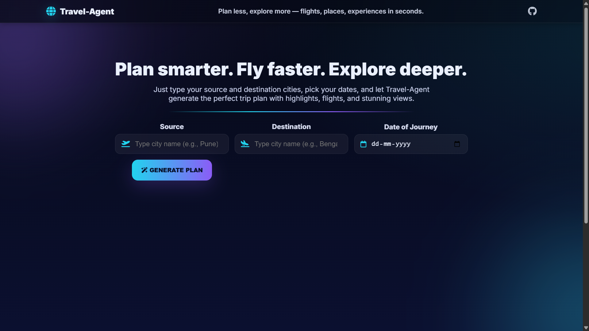
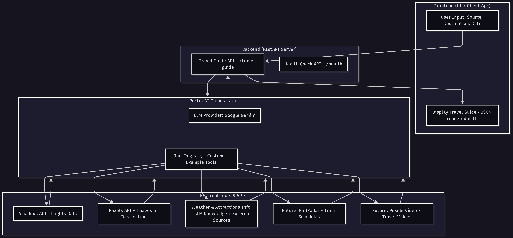

# Travel Agent – AI Powered Travel Guide 🌍



## Overview

The **Travel Agent** project is an AI-driven travel assistant built with **FastAPI** and **Portia AI**.  
It helps users plan their journey by providing:

- Destination overview
- Weather details
- Top attractions
- Flight schedules (via Amadeus)
- Images of the destination (via Pexels)

Simply provide:
- **Source city** (current location)
- **Destination city** (where you want to go)
- **Journey date**

The system then generates a structured travel guide in **JSON format**, which can be consumed by a frontend application.

---

## Features

- 🌐 Destination insights and overview
- ☁️ Weather forecast
- ✈️ Real-time flight schedules (Amadeus API)
- 🖼️ Images of attractions (Pexels API)
- 🔗 Extensible architecture (supports adding tools for trains, videos, etc.)
- ⚡ Built on **FastAPI** with **Portia AI integration**

---

## Tech Stack

- **Backend:** FastAPI
- **AI Orchestration:** Portia AI
- **LLM Provider:** Google Gemini
- **External Tools:**
    - Amadeus API → Flights
    - Pexels API → Images


---

## Project Flow Diagram




## Setup Instructions

### 1. Clone the Repository
```bash
git clone https://github.com/your-username/travel-agent.git
cd travel-agent
```

### 2. Create and Activate Virtual Environment
```bash
python -m venv venv
source venv/bin/activate   # Linux/Mac
venv\Scripts\activate      # Windows
```
###3. Install Dependencies
```bash
   pip install -r requirements.txt
```

###4. Configure Environment Variables

Create a .env file in the root directory and add:

```bash
PORTIA_API_KEY=your_portia_key
GOOGLE_API_KEY=your_google_key
TAVILY_API_KEY=your_tavily_key

PEXELS_API_KEY=your_pexels_key
AMADEUS_API_KEY=your_amadeus_key
AMADEUS_API_SECRET=your_amadeus_secret
```

### 5. Run the Server
```bash
   uvicorn api:app --reload
```

The API will be available at:
```bash
http://127.0.0.1:8000
```
## API Endpoints

 - ### Health Check
```bash
GET /health
```
- Returns a simple service status.

### Travel Guide
```bash
POST /travel-guide
```

- Request body:
```bash
{
  "source": "Mumbai",
  "destination": "Paris",
  "journey_date": "2025-09-10"
}

```
- Response: JSON with
```bash
- Overview
- Weather
- Attractions
- Flights
- Images
```

## Future Enhancements
- 🚆 Integration with RailRadar for train information

- 🎥 Pexels videos for immersive travel previews

- 🏨 Hotel & stay recommendations

- 📍 Map integration for attractions